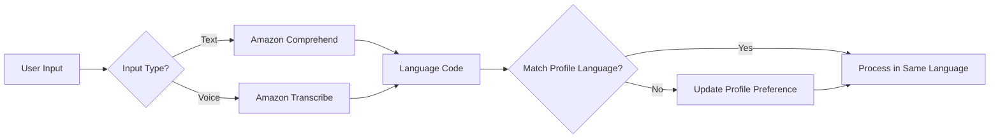

# Design Document: Bharat Access Hub

## Overview

Bharat Access Hub is an AI-powered platform that connects Indian citizens with government schemes, educational opportunities, and public resources. The system leverages AWS cloud services with a focus on AI/ML capabilities including Retrieval Augmented Generation (RAG), natural language processing, and document intelligence.

The platform addresses critical challenges:
- Low scheme awareness (30-40% among eligible beneficiaries)
- High application drop-off rates (70%)
- Language barriers across 10 supported languages
- Information fragmentation across 100+ government portals

### Core Technical Approach

The system uses a microservices architecture deployed on AWS, with AI/ML capabilities powered by Amazon Bedrock (Claude 3 Sonnet for LLM, Titan Embeddings for vectors). The RAG system combines semantic search via Amazon OpenSearch with LLM generation to provide personalized, context-aware responses. All user data is encrypted and compliant with India's DPDPA 2023.

### Key Design Principles

1. **AI-First**: RAG-powered chatbot and intelligent matching at the core
2. **Privacy-First**: End-to-end encryption, RBAC, DPDPA compliance
3. **Mobile-First**: Optimized for low-bandwidth, offline-capable
4. **Language-First**: Native support for 10 Indian languages
5. **Scalability**: Serverless architecture supporting 10,000+ concurrent users

## Architecture

### High-Level System Architecture

```mermaid
graph TB
    subgraph "Client Layer"
        WEB[Web App - React]
        MOBILE[Mobile App - React Native]
        VOICE[Voice Interface]
    end

    subgraph "API Gateway Layer"
        APIGW[API Gateway - REST]
        WSGW[API Gateway - WebSocket]
        CDN[CloudFront CDN]
    end

    subgraph "Authentication & Authorization"
        COGNITO[AWS Cognito]
        RBAC[RBAC Service - Lambda]
    end

    subgraph "Application Services - Lambda"
        PROFILE[Profile Service]
        ELIGIBILITY[Eligibility Service]
        CHAT[Chat Service]
        DOC[Document Service]
        SEARCH[Search Service]
        NOTIF[Notification Service]
    end

    subgraph "AI/ML Services"
        BEDROCK_LLM[Bedrock - Claude 3 Sonnet]
        BEDROCK_EMB[Bedrock - Titan Embeddings]
        TEXTRACT[Amazon Textract]
        COMPREHEND[Amazon Comprehend]
        TRANSCRIBE[Amazon Transcribe]
        POLLY[Amazon Polly]
        TRANSLATE[Amazon Translate]
    end

    subgraph "Data Layer"
        OPENSEARCH[OpenSearch - Vector DB]
        DYNAMO[DynamoDB]
        RDS[RDS PostgreSQL]
        S3[S3 Storage]
        REDIS[ElastiCache Redis]
    end

    subgraph "Monitoring & Security"
        CLOUDWATCH[CloudWatch Logs]
        XRAY[X-Ray Tracing]
        KMS[AWS KMS]
        WAF[AWS WAF]
    end

    WEB --> CDN
    MOBILE --> CDN
    VOICE --> APIGW
    CDN --> APIGW
    CDN --> WSGW

    APIGW --> COGNITO
    WSGW --> COGNITO
    COGNITO --> RBAC

    APIGW --> PROFILE
    APIGW --> ELIGIBILITY
    APIGW --> SEARCH
    APIGW --> DOC
    APIGW --> NOTIF
    WSGW --> CHAT

    CHAT --> BEDROCK_LLM
    CHAT --> BEDROCK_EMB
    CHAT --> OPENSEARCH
    CHAT --> COMPREHEND
    ELIGIBILITY --> BEDROCK_EMB
    SEARCH --> OPENSEARCH
    DOC --> TEXTRACT
    VOICE --> TRANSCRIBE
    VOICE --> POLLY
    CHAT --> TRANSLATE

    PROFILE --> DYNAMO
    ELIGIBILITY --> DYNAMO
    ELIGIBILITY --> RDS
    CHAT --> DYNAMO
    DOC --> S3
    SEARCH --> RDS
    SEARCH --> REDIS

    PROFILE --> KMS
    DYNAMO --> KMS
    RDS --> KMS
    S3 --> KMS

    PROFILE --> CLOUDWATCH
    CHAT --> CLOUDWATCH
    ELIGIBILITY --> CLOUDWATCH
    APIGW --> XRAY
    APIGW --> WAF
```



### Data Flow Architecture

**User Query Flow (RAG Pipeline)**:
1. User sends query via WebSocket → API Gateway
2. Chat Service receives message → Amazon Comprehend detects language
3. Query → Bedrock Titan Embeddings → 1536-dim vector
4. Vector → OpenSearch semantic search → Top 5 relevant chunks
5. Chunks + User Profile + Query → Bedrock Claude 3 Sonnet
6. LLM generates personalized response → User via WebSocket

**Eligibility Matching Flow**:
1. User completes profile → Profile Service → DynamoDB
2. Profile change triggers Eligibility Service
3. Eligibility Service fetches all active schemes from RDS
4. For each scheme: compute score based on criteria matching
5. Scores stored in DynamoDB with timestamp
6. Dashboard Service retrieves and ranks by (score × benefit × urgency)

**Document Processing Flow**:
1. User uploads document → S3 (encrypted)
2. S3 trigger → Document Service Lambda
3. Lambda → Amazon Textract (OCR + form detection)
4. Extracted text + fields → Bedrock Claude for explanation
5. Auto-fill suggestions generated from user profile
6. Results cached in Redis, returned to user


## AI/ML Architecture (Core Focus)

### RAG (Retrieval Augmented Generation) Implementation

The RAG system is the core intelligence layer that enables personalized, accurate responses to user queries about government schemes.

#### Architecture Components

**1. Document Ingestion Pipeline**
- Scheme documents (PDFs, web pages) → S3
- Lambda function triggered on upload
- Text extraction via Textract (for PDFs) or web scraping
- Document chunking strategy (see below)
- Embedding generation via Bedrock Titan Embeddings
- Storage in OpenSearch with metadata

**2. Query Processing Pipeline**
- User query → Language detection (Comprehend)
- Query embedding generation (Titan Embeddings)
- Semantic search in OpenSearch (cosine similarity)
- Top-K retrieval (K=5 by default)
- Context augmentation with user profile
- LLM prompt construction

**3. Response Generation Pipeline**
- Retrieved chunks + user profile + conversation history → Prompt
- Bedrock Claude 3 Sonnet inference
- Response post-processing (formatting, translation if needed)
- Response caching in Redis for similar queries
- Delivery via WebSocket

#### Document Chunking Strategy

**Chunking Algorithm**:
- **Chunk Size**: 512 tokens (approximately 400 words)
- **Overlap**: 50 tokens between consecutive chunks
- **Boundary Respect**: Split on sentence boundaries, not mid-sentence
- **Metadata Preservation**: Each chunk stores scheme_id, chunk_index, section_title

**Rationale**:
- 512 tokens fits within Titan Embeddings input limit (8192 tokens)
- Provides sufficient context for semantic understanding
- Overlap ensures no information loss at boundaries
- Sentence-boundary splitting maintains coherence


**Chunking Implementation**:
```python
def chunk_document(text: str, scheme_id: str, section_title: str) -> List[Chunk]:
    sentences = split_into_sentences(text)  # Using NLTK or spaCy
    chunks = []
    current_chunk = []
    current_tokens = 0
    
    for sentence in sentences:
        sentence_tokens = count_tokens(sentence)
        
        if current_tokens + sentence_tokens > 512:
            # Save current chunk
            chunk_text = ' '.join(current_chunk)
            chunks.append(Chunk(
                text=chunk_text,
                scheme_id=scheme_id,
                section_title=section_title,
                chunk_index=len(chunks)
            ))
            
            # Start new chunk with overlap
            overlap_sentences = current_chunk[-2:]  # Last 2 sentences
            current_chunk = overlap_sentences + [sentence]
            current_tokens = sum(count_tokens(s) for s in current_chunk)
        else:
            current_chunk.append(sentence)
            current_tokens += sentence_tokens
    
    # Save final chunk
    if current_chunk:
        chunk_text = ' '.join(current_chunk)
        chunks.append(Chunk(
            text=chunk_text,
            scheme_id=scheme_id,
            section_title=section_title,
            chunk_index=len(chunks)
        ))
    
    return chunks
```


#### Embedding Generation and Storage

**Embedding Model**: Amazon Bedrock Titan Embeddings G1 - Text
- **Dimensions**: 1536
- **Max Input**: 8192 tokens
- **Output**: Normalized vector (L2 norm = 1)

**Embedding Generation Process**:
1. Chunk text → Bedrock Titan Embeddings API
2. API returns 1536-dimensional vector
3. Vector normalized (already done by Titan)
4. Store in OpenSearch with metadata

**OpenSearch Index Schema**:
```json
{
  "mappings": {
    "properties": {
      "chunk_id": {"type": "keyword"},
      "scheme_id": {"type": "keyword"},
      "chunk_index": {"type": "integer"},
      "section_title": {"type": "text"},
      "text": {"type": "text"},
      "embedding": {
        "type": "knn_vector",
        "dimension": 1536,
        "method": {
          "name": "hnsw",
          "space_type": "cosinesimil",
          "engine": "nmslib",
          "parameters": {
            "ef_construction": 512,
            "m": 16
          }
        }
      },
      "scheme_category": {"type": "keyword"},
      "language": {"type": "keyword"},
      "created_at": {"type": "date"}
    }
  }
}
```

**HNSW Parameters Rationale**:
- **ef_construction=512**: Higher value for better recall during index building
- **m=16**: Balanced between memory usage and search quality
- **cosinesimil**: Standard for normalized embeddings


#### Semantic Search Algorithm

**Query Embedding**:
```python
def generate_query_embedding(query: str) -> List[float]:
    response = bedrock_client.invoke_model(
        modelId='amazon.titan-embed-text-v1',
        body=json.dumps({"inputText": query})
    )
    embedding = json.loads(response['body'].read())['embedding']
    return embedding
```

**OpenSearch KNN Query**:
```python
def semantic_search(query_embedding: List[float], user_profile: dict, k: int = 5) -> List[dict]:
    # Build filter based on user profile
    filters = []
    if user_profile.get('preferred_language'):
        filters.append({"term": {"language": user_profile['preferred_language']}})
    
    query = {
        "size": k,
        "query": {
            "bool": {
                "must": [
                    {
                        "knn": {
                            "embedding": {
                                "vector": query_embedding,
                                "k": k
                            }
                        }
                    }
                ],
                "filter": filters
            }
        },
        "_source": ["chunk_id", "scheme_id", "text", "section_title"]
    }
    
    response = opensearch_client.search(index="scheme_chunks", body=query)
    return [hit['_source'] for hit in response['hits']['hits']]
```

**Hybrid Search Enhancement** (Optional):
- Combine semantic search (KNN) with keyword search (BM25)
- Weighted combination: 0.7 × semantic_score + 0.3 × keyword_score
- Improves recall for exact term matches (e.g., scheme names)


#### Context Augmentation for LLM Prompts

**Prompt Construction Strategy**:
```python
def build_rag_prompt(
    user_query: str,
    retrieved_chunks: List[dict],
    user_profile: dict,
    conversation_history: List[dict]
) -> str:
    # System prompt
    system_prompt = """You are an AI assistant for Bharat Access Hub, helping Indian citizens 
    discover and apply for government schemes. Provide accurate, helpful, and personalized 
    responses based on the user's profile and retrieved scheme information. Always cite specific 
    schemes when making recommendations."""
    
    # User profile context
    profile_context = f"""
    User Profile:
    - Age: {user_profile.get('age')}
    - Location: {user_profile.get('state')}, {user_profile.get('district')}
    - Education: {user_profile.get('education_level')}
    - Employment: {user_profile.get('employment_status')}
    - Annual Income: ₹{user_profile.get('annual_income')}
    - Family Size: {user_profile.get('family_size')}
    """
    
    # Retrieved context
    context_chunks = "\n\n".join([
        f"[Scheme: {chunk['scheme_id']}, Section: {chunk['section_title']}]\n{chunk['text']}"
        for chunk in retrieved_chunks
    ])
    
    # Conversation history (last 5 turns)
    history_text = "\n".join([
        f"User: {turn['user_message']}\nAssistant: {turn['assistant_response']}"
        for turn in conversation_history[-5:]
    ])
    
    # Final prompt
    prompt = f"""{system_prompt}

{profile_context}

Relevant Scheme Information:
{context_chunks}

Conversation History:
{history_text}

User Query: {user_query}


Assistant Response:"""
    
    return prompt
```

**Token Management**:
- Claude 3 Sonnet context window: 200K tokens
- Target prompt size: <8K tokens (leaves room for response)
- If prompt exceeds limit: truncate conversation history first, then reduce chunks

#### Response Generation Flow

**Bedrock Claude 3 Sonnet Invocation**:
```python
def generate_response(prompt: str, temperature: float = 0.7) -> str:
    response = bedrock_client.invoke_model(
        modelId='anthropic.claude-3-sonnet-20240229-v1:0',
        body=json.dumps({
            "anthropic_version": "bedrock-2023-05-31",
            "max_tokens": 2048,
            "temperature": temperature,
            "messages": [
                {
                    "role": "user",
                    "content": prompt
                }
            ]
        })
    )
    
    result = json.loads(response['body'].read())
    return result['content'][0]['text']
```

**Response Post-Processing**:
1. Extract response text from Bedrock API response
2. If user's preferred language ≠ English: translate via Amazon Translate
3. Format markdown for rich text display
4. Extract any scheme IDs mentioned for tracking
5. Cache response in Redis (key: hash(query + profile_id), TTL: 1 hour)
6. Store in DynamoDB for conversation history


**Response Caching Strategy**:
- Cache key: `SHA256(query_text + user_profile_hash + language)`
- TTL: 1 hour for general queries, 5 minutes for eligibility queries
- Cache invalidation: When user profile changes or scheme data updates
- Cache hit rate target: >40% (reduces LLM costs and latency)

### Amazon Bedrock Integration

**Model Selection Rationale**:

**Claude 3 Sonnet** (LLM):
- Balanced performance/cost ($3 per 1M input tokens, $15 per 1M output tokens)
- 200K context window (handles large scheme documents)
- Strong multilingual capabilities (important for Indian languages)
- Good at following instructions for personalized responses
- Lower latency than Claude 3 Opus

**Titan Embeddings G1** (Embeddings):
- Cost-effective ($0.10 per 1M tokens)
- 1536 dimensions (good balance of quality and storage)
- Optimized for semantic search
- Native AWS integration with OpenSearch

**Configuration**:
```python
# Bedrock client setup
bedrock_client = boto3.client(
    service_name='bedrock-runtime',
    region_name='us-east-1'  # Bedrock availability
)

# LLM inference parameters
LLM_CONFIG = {
    'temperature': 0.7,  # Balanced creativity/consistency
    'max_tokens': 2048,  # Sufficient for detailed responses
    'top_p': 0.9,
    'top_k': 250
}

# Embedding parameters
EMBEDDING_CONFIG = {
    'model_id': 'amazon.titan-embed-text-v1',
    'dimensions': 1536
}
```


### Amazon OpenSearch Vector Database Setup

**Cluster Configuration**:
- **Instance Type**: r6g.xlarge.search (4 vCPU, 32 GB RAM)
- **Node Count**: 3 (for high availability)
- **Storage**: 500 GB EBS (gp3) per node
- **Availability Zones**: 3 (multi-AZ deployment)

**Index Strategy**:
- **Primary Index**: `scheme_chunks` (vector embeddings + metadata)
- **Secondary Index**: `schemes` (full scheme metadata for filtering)
- **Refresh Interval**: 30 seconds (balance between freshness and performance)

**Performance Tuning**:
```json
{
  "index": {
    "knn": true,
    "knn.algo_param.ef_search": 512,
    "number_of_shards": 3,
    "number_of_replicas": 2,
    "refresh_interval": "30s"
  }
}
```

**Capacity Planning**:
- Estimated chunks: 100,000 (1,000 schemes × 100 chunks average)
- Vector size: 1536 dimensions × 4 bytes = 6 KB per vector
- Total vector storage: 600 MB
- With metadata: ~1.5 GB total
- 500 GB provides ample headroom for growth

**Security**:
- VPC deployment (private subnets)
- Fine-grained access control enabled
- Encryption at rest (AWS KMS)
- Encryption in transit (TLS 1.3)
- IAM role-based access from Lambda functions


## AWS Services Specifications

### Amazon Textract (OCR)

**Use Cases**:
- Extract text from uploaded government forms (PDF, JPEG, PNG)
- Detect form fields and tables
- Extract key-value pairs from structured documents

**API Configuration**:
```python
def extract_document_text(s3_bucket: str, s3_key: str) -> dict:
    response = textract_client.analyze_document(
        Document={'S3Object': {'Bucket': s3_bucket, 'Name': s3_key}},
        FeatureTypes=['FORMS', 'TABLES']
    )
    return response
```

**Processing Pipeline**:
1. User uploads document → S3
2. Lambda triggered by S3 event
3. Textract analyzes document (async for large files)
4. Extract text, forms, tables
5. Store results in DynamoDB
6. Return structured data to user

**Cost Optimization**:
- Use Textract only for forms (not plain text PDFs)
- Cache results in DynamoDB (avoid re-processing)
- Estimated cost: $1.50 per 1,000 pages

### Amazon Comprehend (Language Detection)

**Use Cases**:
- Detect language of user queries
- Sentiment analysis for feedback
- Entity extraction from scheme descriptions

**API Configuration**:
```python
def detect_language(text: str) -> str:
    response = comprehend_client.detect_dominant_language(Text=text)
    languages = response['Languages']
    return languages[0]['LanguageCode'] if languages else 'en'
```

**Supported Languages** (ISO 639-1 codes):
- hi (Hindi), en (English), ta (Tamil), te (Telugu), bn (Bengali)
- mr (Marathi), gu (Gujarati), kn (Kannada), ml (Malayalam), pa (Punjabi)


### Amazon Transcribe (Speech-to-Text)

**Use Cases**:
- Convert voice queries to text
- Support voice-based profile creation
- Enable voice navigation for low-literacy users

**API Configuration**:
```python
def transcribe_audio(audio_s3_uri: str, language_code: str) -> str:
    job_name = f"transcribe_{uuid.uuid4()}"
    transcribe_client.start_transcription_job(
        TranscriptionJobName=job_name,
        Media={'MediaFileUri': audio_s3_uri},
        MediaFormat='mp3',
        LanguageCode=language_code,
        Settings={
            'ShowSpeakerLabels': False,
            'MaxSpeakerLabels': 1
        }
    )
    # Poll for completion
    while True:
        status = transcribe_client.get_transcription_job(TranscriptionJobName=job_name)
        if status['TranscriptionJob']['TranscriptionJobStatus'] in ['COMPLETED', 'FAILED']:
            break
        time.sleep(2)
    
    transcript_uri = status['TranscriptionJob']['Transcript']['TranscriptFileUri']
    transcript = requests.get(transcript_uri).json()
    return transcript['results']['transcripts'][0]['transcript']
```

**Supported Languages**: Same 10 languages as Comprehend

**Real-Time vs Batch**:
- Use real-time streaming for interactive voice chat
- Use batch for uploaded audio files


### Amazon Polly (Text-to-Speech)

**Use Cases**:
- Convert chatbot responses to speech
- Read scheme descriptions aloud
- Provide audio guidance for forms

**API Configuration**:
```python
def synthesize_speech(text: str, language_code: str, voice_id: str) -> bytes:
    response = polly_client.synthesize_speech(
        Text=text,
        OutputFormat='mp3',
        VoiceId=voice_id,
        Engine='neural',  # Higher quality
        LanguageCode=language_code
    )
    return response['AudioStream'].read()
```

**Voice Selection** (Neural voices):
- Hindi: Kajal (female), Aditi (female)
- English (Indian): Aditi, Raveena
- Tamil: Not available (use standard engine)
- Telugu, Bengali, Marathi, Gujarati, Kannada, Malayalam, Punjabi: Use standard engine

**Speech Rate Control**:
```xml
<speak>
    <prosody rate="slow">Your text here</prosody>
</speak>
```

### Amazon Translate

**Use Cases**:
- Translate scheme content to user's preferred language
- Translate chatbot responses
- Translate UI elements

**API Configuration**:
```python
def translate_text(text: str, source_lang: str, target_lang: str) -> str:
    response = translate_client.translate_text(
        Text=text,
        SourceLanguageCode=source_lang,
        TargetLanguageCode=target_lang
    )
    return response['TranslatedText']
```

**Caching Strategy**:
- Cache translations in DynamoDB
- Key: `SHA256(text + source_lang + target_lang)`
- TTL: 30 days
- Reduces API calls by ~80%


### AWS Lambda (Compute)

**Function Architecture**:
- **Runtime**: Python 3.11 (for AI/ML libraries), Node.js 18 (for API services)
- **Memory**: 512 MB (API functions), 2048 MB (AI/ML functions)
- **Timeout**: 30 seconds (API), 5 minutes (document processing)
- **Concurrency**: Reserved concurrency of 100 per critical function

**Key Lambda Functions**:

1. **ProfileService** (Node.js)
   - CRUD operations for user profiles
   - Memory: 512 MB, Timeout: 10s

2. **EligibilityService** (Python)
   - Compute eligibility scores
   - Memory: 1024 MB, Timeout: 30s

3. **ChatService** (Python)
   - RAG pipeline orchestration
   - Memory: 2048 MB, Timeout: 30s

4. **DocumentService** (Python)
   - Textract integration, form processing
   - Memory: 2048 MB, Timeout: 5 minutes

5. **SearchService** (Python)
   - OpenSearch queries
   - Memory: 512 MB, Timeout: 10s

6. **NotificationService** (Node.js)
   - SNS/SES integration
   - Memory: 256 MB, Timeout: 10s

7. **SchemeIngestionService** (Python)
   - Document chunking, embedding generation
   - Memory: 3008 MB, Timeout: 15 minutes

**VPC Configuration**:
- Deploy in private subnets
- NAT Gateway for internet access (Bedrock, Textract APIs)
- Security groups restrict access to RDS, OpenSearch, ElastiCache


### Amazon API Gateway

**REST API**:
- **Endpoints**: /profile, /schemes, /eligibility, /search, /documents, /applications
- **Authentication**: AWS Cognito authorizer
- **Throttling**: 1000 requests/second burst, 500 steady-state
- **CORS**: Enabled for web/mobile clients
- **Caching**: 5-minute TTL for GET requests

**WebSocket API**:
- **Route**: /chat
- **Connection Management**: Store connection IDs in DynamoDB
- **Message Routing**: $connect, $disconnect, sendMessage, receiveMessage
- **Idle Timeout**: 30 minutes

**API Gateway Configuration**:
```yaml
RestAPI:
  StageName: prod
  EndpointConfiguration: REGIONAL
  TracingEnabled: true
  AccessLogSettings:
    DestinationArn: !GetAtt ApiLogGroup.Arn
    Format: $context.requestId $context.error.message $context.error.messageString
  MethodSettings:
    - ResourcePath: "/*"
      HttpMethod: "*"
      ThrottlingBurstLimit: 1000
      ThrottlingRateLimit: 500
      CachingEnabled: true
      CacheTtlInSeconds: 300

WebSocketAPI:
  RouteSelectionExpression: "$request.body.action"
  ApiKeySelectionExpression: "$request.header.x-api-key"
```


### AWS Cognito (Authentication)

**User Pool Configuration**:
```yaml
UserPool:
  UsernameAttributes:
    - email
    - phone_number
  AutoVerifiedAttributes:
    - email
    - phone_number
  MfaConfiguration: OPTIONAL
  PasswordPolicy:
    MinimumLength: 8
    RequireUppercase: true
    RequireLowercase: true
    RequireNumbers: true
    RequireSymbols: false
  AccountRecoverySetting:
    RecoveryMechanisms:
      - Name: verified_email
        Priority: 1
      - Name: verified_phone_number
        Priority: 2
  UserAttributeUpdateSettings:
    AttributesRequireVerificationBeforeUpdate:
      - email
```

**User Attributes**:
- Standard: email, phone_number, name, preferred_language
- Custom: user_id (UUID), profile_completion_percentage, registration_date

**Authentication Flow**:
1. User registers → Cognito User Pool
2. Email/SMS verification code sent
3. User verifies → Account activated
4. User logs in → Cognito returns JWT tokens (ID token, Access token, Refresh token)
5. Client includes ID token in API requests
6. API Gateway validates token via Cognito authorizer

**Token Expiration**:
- ID Token: 1 hour
- Access Token: 1 hour
- Refresh Token: 30 days


### Amazon DynamoDB (NoSQL)

**Tables**:

**1. Users Table**
```yaml
TableName: bharat-users
PartitionKey: user_id (String)
Attributes:
  - user_id: UUID
  - email: String
  - phone_number: String
  - preferred_language: String
  - profile_data: Map (demographics, location, education, employment, income, family, assets)
  - profile_completion_percentage: Number
  - created_at: String (ISO 8601)
  - updated_at: String (ISO 8601)
BillingMode: PAY_PER_REQUEST
EncryptionType: AWS_MANAGED (KMS)
PointInTimeRecovery: Enabled
```

**2. EligibilityScores Table**
```yaml
TableName: bharat-eligibility-scores
PartitionKey: user_id (String)
SortKey: scheme_id (String)
Attributes:
  - user_id: UUID
  - scheme_id: String
  - eligibility_score: Number (0-100)
  - matching_criteria: List (criteria that matched)
  - missing_criteria: List (criteria not met)
  - computed_at: String (ISO 8601)
  - expires_at: Number (TTL)
GlobalSecondaryIndex:
  - IndexName: scheme-score-index
    PartitionKey: scheme_id
    SortKey: eligibility_score
BillingMode: PAY_PER_REQUEST
TTL: expires_at (7 days)
```


**3. ChatHistory Table**
```yaml
TableName: bharat-chat-history
PartitionKey: user_id (String)
SortKey: timestamp (String)
Attributes:
  - user_id: UUID
  - session_id: UUID
  - timestamp: String (ISO 8601)
  - user_message: String
  - assistant_response: String
  - language: String
  - retrieved_chunks: List (chunk IDs)
  - tokens_used: Number
  - latency_ms: Number
BillingMode: PAY_PER_REQUEST
TTL: expires_at (90 days)
```

**4. Applications Table**
```yaml
TableName: bharat-applications
PartitionKey: user_id (String)
SortKey: application_id (String)
Attributes:
  - user_id: UUID
  - application_id: UUID
  - scheme_id: String
  - status: String (draft, submitted, in_review, approved, rejected)
  - form_data: Map
  - documents: List (S3 keys)
  - submitted_at: String (ISO 8601)
  - updated_at: String (ISO 8601)
GlobalSecondaryIndex:
  - IndexName: scheme-applications-index
    PartitionKey: scheme_id
    SortKey: submitted_at
BillingMode: PAY_PER_REQUEST
```

**5. TranslationCache Table**
```yaml
TableName: bharat-translation-cache
PartitionKey: translation_key (String)
Attributes:
  - translation_key: String (SHA256 hash)
  - source_text: String
  - source_language: String
  - target_language: String
  - translated_text: String
  - created_at: String (ISO 8601)
  - expires_at: Number (TTL)
BillingMode: PAY_PER_REQUEST
TTL: expires_at (30 days)
```


### Amazon RDS PostgreSQL (Relational)

**Instance Configuration**:
- **Instance Class**: db.r6g.xlarge (4 vCPU, 32 GB RAM)
- **Engine**: PostgreSQL 15.3
- **Storage**: 500 GB gp3 (16,000 IOPS)
- **Multi-AZ**: Enabled (for high availability)
- **Backup**: Automated daily backups, 7-day retention
- **Encryption**: At rest (KMS), in transit (TLS)

**Database Schema**:

**Schemes Table**:
```sql
CREATE TABLE schemes (
    scheme_id VARCHAR(100) PRIMARY KEY,
    scheme_name VARCHAR(500) NOT NULL,
    description TEXT,
    category VARCHAR(100) NOT NULL,
    benefit_type VARCHAR(100),
    benefit_amount DECIMAL(12, 2),
    application_deadline DATE,
    is_active BOOLEAN DEFAULT true,
    eligibility_criteria JSONB NOT NULL,
    required_documents JSONB,
    application_url TEXT,
    official_portal TEXT,
    state VARCHAR(100),
    district VARCHAR(100),
    language VARCHAR(10) DEFAULT 'en',
    created_at TIMESTAMP DEFAULT CURRENT_TIMESTAMP,
    updated_at TIMESTAMP DEFAULT CURRENT_TIMESTAMP,
    version INTEGER DEFAULT 1
);

CREATE INDEX idx_schemes_category ON schemes(category);
CREATE INDEX idx_schemes_state ON schemes(state);
CREATE INDEX idx_schemes_deadline ON schemes(application_deadline);
CREATE INDEX idx_schemes_active ON schemes(is_active);
CREATE INDEX idx_schemes_eligibility ON schemes USING GIN(eligibility_criteria);
```


**SchemeDocuments Table**:
```sql
CREATE TABLE scheme_documents (
    document_id SERIAL PRIMARY KEY,
    scheme_id VARCHAR(100) REFERENCES schemes(scheme_id),
    document_type VARCHAR(50),
    s3_key TEXT NOT NULL,
    file_name VARCHAR(500),
    file_size_bytes BIGINT,
    uploaded_at TIMESTAMP DEFAULT CURRENT_TIMESTAMP,
    processed BOOLEAN DEFAULT false,
    chunk_count INTEGER
);

CREATE INDEX idx_scheme_docs_scheme ON scheme_documents(scheme_id);
```

**AuditLog Table**:
```sql
CREATE TABLE audit_log (
    log_id SERIAL PRIMARY KEY,
    user_id UUID,
    action VARCHAR(100) NOT NULL,
    resource_type VARCHAR(100),
    resource_id VARCHAR(100),
    ip_address INET,
    user_agent TEXT,
    timestamp TIMESTAMP DEFAULT CURRENT_TIMESTAMP,
    details JSONB
);

CREATE INDEX idx_audit_user ON audit_log(user_id);
CREATE INDEX idx_audit_timestamp ON audit_log(timestamp);
```

**Connection Pooling**:
- Use RDS Proxy for connection pooling
- Max connections: 1000
- Connection timeout: 30 seconds


### Amazon S3 (Storage)

**Buckets**:

**1. bharat-user-documents**
- **Purpose**: Store user-uploaded documents (forms, IDs, certificates)
- **Encryption**: SSE-KMS (customer-managed key)
- **Versioning**: Enabled
- **Lifecycle**: Transition to Glacier after 90 days, delete after 7 years
- **Access**: Private, pre-signed URLs for user access (1-hour expiry)

**2. bharat-scheme-documents**
- **Purpose**: Store scheme PDFs, guidelines, forms
- **Encryption**: SSE-S3
- **Versioning**: Enabled
- **Lifecycle**: No expiration
- **Access**: Public read via CloudFront

**3. bharat-static-assets**
- **Purpose**: Web/mobile app assets (images, CSS, JS)
- **Encryption**: SSE-S3
- **Versioning**: Disabled
- **Lifecycle**: No expiration
- **Access**: Public read via CloudFront

**S3 Event Notifications**:
- Trigger Lambda on document upload to `bharat-user-documents`
- Trigger Lambda on scheme document upload to `bharat-scheme-documents`

### Amazon ElastiCache Redis (Caching)

**Cluster Configuration**:
- **Node Type**: cache.r6g.large (2 vCPU, 13.07 GB RAM)
- **Nodes**: 3 (1 primary, 2 replicas)
- **Engine**: Redis 7.0
- **Multi-AZ**: Enabled
- **Encryption**: At rest and in transit

**Cache Keys**:
- `user:profile:{user_id}` → User profile data (TTL: 5 minutes)
- `dashboard:{user_id}` → Dashboard data (TTL: 5 minutes)
- `scheme:{scheme_id}` → Scheme details (TTL: 1 hour)
- `search:{query_hash}` → Search results (TTL: 10 minutes)
- `chat:response:{query_hash}` → Chatbot responses (TTL: 1 hour)
- `eligibility:{user_id}` → Eligibility scores (TTL: 5 minutes)


### Amazon CloudFront (CDN)

**Distribution Configuration**:
- **Origin**: S3 bucket (bharat-static-assets), API Gateway
- **Price Class**: PriceClass_All (global distribution)
- **SSL Certificate**: ACM certificate for custom domain
- **Caching**: Default TTL 86400 seconds (24 hours)
- **Compression**: Enabled (gzip, brotli)
- **Security**: AWS WAF integration, geo-restriction disabled

**Cache Behaviors**:
- `/static/*` → S3 origin, cache for 24 hours
- `/api/*` → API Gateway origin, cache for 5 minutes (GET only)
- `/schemes/*` → S3 origin, cache for 1 hour

### Amazon SNS/SES (Notifications)

**SNS Topics**:
- `bharat-new-scheme-notifications` → New scheme alerts
- `bharat-deadline-reminders` → Deadline reminders
- `bharat-application-updates` → Application status updates

**SES Configuration**:
- **Sending Domain**: noreply@bharataccesshub.gov.in
- **Email Templates**: HTML templates for notifications
- **Bounce Handling**: SNS topic for bounces/complaints
- **Daily Sending Quota**: 50,000 emails

**SMS via SNS**:
- **Sender ID**: BHARAT
- **Message Type**: Transactional
- **Monthly Budget**: ₹50,000 (~10,000 SMS)


## Components and Interfaces

### Profile Service

**Responsibilities**:
- Create, read, update, delete user profiles
- Validate profile data
- Trigger eligibility recalculation on updates
- Encrypt PII before storage

**Interface**:
```typescript
interface ProfileService {
  createProfile(userId: string, profileData: ProfileData): Promise<Profile>;
  getProfile(userId: string): Promise<Profile>;
  updateProfile(userId: string, updates: Partial<ProfileData>): Promise<Profile>;
  deleteProfile(userId: string): Promise<void>;
  calculateCompletionPercentage(profile: Profile): number;
}

interface ProfileData {
  demographics: {
    age: number;
    gender: string;
    category: string; // General, SC, ST, OBC
    disability: boolean;
  };
  location: {
    state: string;
    district: string;
    pincode: string;
    ruralUrban: string;
  };
  education: {
    level: string; // Below 10th, 10th, 12th, Graduate, Postgraduate
    field: string;
    institution: string;
  };
  employment: {
    status: string; // Employed, Unemployed, Self-employed, Student
    sector: string;
    monthlyIncome: number;
  };
  family: {
    size: number;
    dependents: number;
    annualIncome: number;
  };
  assets: {
    landOwnership: boolean;
    landArea: number;
    vehicleOwnership: boolean;
    homeOwnership: boolean;
  };
}
```


### Eligibility Service

**Responsibilities**:
- Compute eligibility scores for user-scheme pairs
- Evaluate criteria matching
- Rank schemes by relevance
- Cache scores for performance

**Interface**:
```typescript
interface EligibilityService {
  computeEligibilityScore(userId: string, schemeId: string): Promise<EligibilityScore>;
  computeAllScores(userId: string): Promise<EligibilityScore[]>;
  getRankedSchemes(userId: string, limit: number): Promise<RankedScheme[]>;
  invalidateScores(userId: string): Promise<void>;
}

interface EligibilityScore {
  userId: string;
  schemeId: string;
  score: number; // 0-100
  matchingCriteria: string[];
  missingCriteria: string[];
  computedAt: string;
}

interface RankedScheme {
  scheme: Scheme;
  eligibilityScore: number;
  rankingScore: number; // score × benefit × urgency
  reason: string; // AI-generated explanation
}
```

**Scoring Algorithm**:
```python
def compute_eligibility_score(user_profile: dict, scheme: dict) -> float:
    criteria = scheme['eligibility_criteria']
    total_criteria = len(criteria)
    matched_criteria = 0
    
    for criterion in criteria:
        if evaluate_criterion(user_profile, criterion):
            matched_criteria += 1
    
    base_score = (matched_criteria / total_criteria) * 100
    
    # Apply weights
    if scheme['category'] in user_profile.get('preferred_categories', []):
        base_score *= 1.1  # 10% boost
    
    return min(base_score, 100)
```


### Chat Service

**Responsibilities**:
- Orchestrate RAG pipeline
- Manage conversation context
- Detect language and translate
- Stream responses via WebSocket

**Interface**:
```typescript
interface ChatService {
  sendMessage(userId: string, sessionId: string, message: string): Promise<ChatResponse>;
  getConversationHistory(userId: string, sessionId: string, limit: number): Promise<ChatMessage[]>;
  closeSession(sessionId: string): Promise<void>;
}

interface ChatMessage {
  messageId: string;
  userId: string;
  sessionId: string;
  timestamp: string;
  role: 'user' | 'assistant';
  content: string;
  language: string;
  metadata?: {
    retrievedChunks?: string[];
    tokensUsed?: number;
    latencyMs?: number;
  };
}

interface ChatResponse {
  messageId: string;
  content: string;
  language: string;
  suggestedActions?: Action[];
  relatedSchemes?: string[];
}

interface Action {
  type: 'view_scheme' | 'update_profile' | 'start_application';
  label: string;
  data: any;
}
```


### Document Service

**Responsibilities**:
- Process uploaded documents via Textract
- Extract form fields and values
- Generate auto-fill suggestions
- Explain form fields in simple language

**Interface**:
```typescript
interface DocumentService {
  processDocument(userId: string, s3Key: string): Promise<ProcessedDocument>;
  explainFormFields(documentId: string, language: string): Promise<FieldExplanation[]>;
  generateAutoFillSuggestions(userId: string, documentId: string): Promise<AutoFillSuggestion[]>;
  validateForm(documentId: string, formData: any): Promise<ValidationResult>;
}

interface ProcessedDocument {
  documentId: string;
  userId: string;
  s3Key: string;
  extractedText: string;
  formFields: FormField[];
  tables: Table[];
  confidence: number;
  processedAt: string;
}

interface FormField {
  fieldName: string;
  fieldType: string; // text, number, date, checkbox
  value?: string;
  confidence: number;
  boundingBox: BoundingBox;
}

interface FieldExplanation {
  fieldName: string;
  explanation: string;
  example: string;
  required: boolean;
}

interface AutoFillSuggestion {
  fieldName: string;
  suggestedValue: string;
  source: string; // profile field name
  confidence: number;
}
```


### Search Service

**Responsibilities**:
- Execute semantic search via OpenSearch
- Apply filters and sorting
- Cache search results
- Track search analytics

**Interface**:
```typescript
interface SearchService {
  searchSchemes(query: string, filters: SearchFilters, userId: string): Promise<SearchResult[]>;
  getSchemeDetails(schemeId: string, userId: string): Promise<SchemeDetails>;
  getSuggestedSearches(query: string): Promise<string[]>;
}

interface SearchFilters {
  categories?: string[];
  benefitAmountRange?: { min: number; max: number };
  deadlineBefore?: string;
  states?: string[];
  eligibilityScoreMin?: number;
}

interface SearchResult {
  scheme: Scheme;
  relevanceScore: number;
  eligibilityScore?: number;
  highlightedText?: string;
}

interface SchemeDetails {
  scheme: Scheme;
  eligibilityAssessment: {
    score: number;
    matchingCriteria: string[];
    missingCriteria: string[];
    recommendation: string;
  };
  applicationGuide: ApplicationStep[];
  relatedSchemes: Scheme[];
}

interface ApplicationStep {
  stepNumber: number;
  title: string;
  description: string;
  requiredDocuments: string[];
  estimatedTime: string;
}
```


## Data Models

### User Profile Schema (DynamoDB)

```json
{
  "user_id": "uuid-v4",
  "email": "user@example.com",
  "phone_number": "+91XXXXXXXXXX",
  "preferred_language": "hi",
  "profile_data": {
    "demographics": {
      "age": 25,
      "gender": "female",
      "category": "OBC",
      "disability": false
    },
    "location": {
      "state": "Maharashtra",
      "district": "Pune",
      "pincode": "411001",
      "ruralUrban": "urban"
    },
    "education": {
      "level": "Graduate",
      "field": "Engineering",
      "institution": "Pune University"
    },
    "employment": {
      "status": "Employed",
      "sector": "IT",
      "monthlyIncome": 50000
    },
    "family": {
      "size": 4,
      "dependents": 2,
      "annualIncome": 600000
    },
    "assets": {
      "landOwnership": false,
      "landArea": 0,
      "vehicleOwnership": true,
      "homeOwnership": false
    }
  },
  "profile_completion_percentage": 85,
  "created_at": "2024-01-15T10:30:00Z",
  "updated_at": "2024-01-20T14:45:00Z"
}
```


### Scheme Metadata Schema (RDS PostgreSQL)

```json
{
  "scheme_id": "PM-KISAN-2024",
  "scheme_name": "Pradhan Mantri Kisan Samman Nidhi",
  "description": "Financial support to farmers providing ₹6000 per year in three installments",
  "category": "Agricultural Schemes",
  "benefit_type": "Direct Benefit Transfer",
  "benefit_amount": 6000.00,
  "application_deadline": "2024-12-31",
  "is_active": true,
  "eligibility_criteria": {
    "age": {"min": 18, "max": null},
    "location": {"states": ["all"]},
    "employment": {"status": ["Farmer", "Self-employed"]},
    "assets": {"landOwnership": true, "landArea": {"max": 2.0}},
    "income": {"annualIncome": {"max": 200000}}
  },
  "required_documents": [
    "Aadhaar Card",
    "Land Ownership Certificate",
    "Bank Account Details",
    "Passport Size Photo"
  ],
  "application_url": "https://pmkisan.gov.in/",
  "official_portal": "PM-KISAN Portal",
  "state": "all",
  "district": "all",
  "language": "en",
  "created_at": "2024-01-01T00:00:00Z",
  "updated_at": "2024-01-15T10:00:00Z",
  "version": 2
}
```


### Chat History Schema (DynamoDB)

```json
{
  "user_id": "uuid-v4",
  "session_id": "session-uuid",
  "timestamp": "2024-01-20T15:30:45Z",
  "user_message": "मुझे कृषि योजनाओं के बारे में बताएं",
  "assistant_response": "आपके प्रोफाइल के आधार पर, आप निम्नलिखित कृषि योजनाओं के लिए पात्र हैं...",
  "language": "hi",
  "retrieved_chunks": [
    "chunk-123",
    "chunk-456",
    "chunk-789"
  ],
  "tokens_used": 1250,
  "latency_ms": 2340,
  "expires_at": 1716220245
}
```

### Application Tracking Schema (DynamoDB)

```json
{
  "user_id": "uuid-v4",
  "application_id": "app-uuid",
  "scheme_id": "PM-KISAN-2024",
  "status": "submitted",
  "form_data": {
    "applicant_name": "Rajesh Kumar",
    "aadhaar_number": "XXXX-XXXX-1234",
    "bank_account": "XXXXXXXXXXXX5678",
    "land_area": 1.5
  },
  "documents": [
    "s3://bharat-user-documents/user-id/aadhaar.pdf",
    "s3://bharat-user-documents/user-id/land-certificate.pdf"
  ],
  "submitted_at": "2024-01-20T16:00:00Z",
  "updated_at": "2024-01-20T16:00:00Z"
}
```


### Vector Embedding Schema (OpenSearch)

```json
{
  "chunk_id": "chunk-uuid",
  "scheme_id": "PM-KISAN-2024",
  "chunk_index": 3,
  "section_title": "Eligibility Criteria",
  "text": "Small and marginal farmers with landholding up to 2 hectares are eligible. The benefit amount of ₹6000 per year is provided in three equal installments of ₹2000 each, directly transferred to the farmer's bank account.",
  "embedding": [0.023, -0.145, 0.089, ...],  // 1536 dimensions
  "scheme_category": "Agricultural Schemes",
  "language": "en",
  "created_at": "2024-01-15T10:00:00Z"
}
```

## API Design

### REST API Endpoints

**Authentication**: All endpoints require Bearer token (Cognito JWT) in Authorization header

**Base URL**: `https://api.bharataccesshub.gov.in/v1`

#### Profile Endpoints

**POST /profile**
- Create new user profile
- Request Body: `ProfileData`
- Response: `Profile` (201 Created)

**GET /profile**
- Get current user's profile
- Response: `Profile` (200 OK)

**PUT /profile**
- Update user profile
- Request Body: `Partial<ProfileData>`
- Response: `Profile` (200 OK)

**DELETE /profile**
- Delete user profile and all data
- Response: 204 No Content


#### Scheme Endpoints

**GET /schemes**
- Search and filter schemes
- Query Parameters:
  - `q`: Search query (optional)
  - `category`: Filter by category (optional)
  - `state`: Filter by state (optional)
  - `minBenefit`: Minimum benefit amount (optional)
  - `maxBenefit`: Maximum benefit amount (optional)
  - `limit`: Results per page (default: 20)
  - `offset`: Pagination offset (default: 0)
- Response: `{ schemes: SearchResult[], total: number }` (200 OK)

**GET /schemes/:schemeId**
- Get detailed scheme information
- Response: `SchemeDetails` (200 OK)

**GET /schemes/:schemeId/application-guide**
- Get step-by-step application guide
- Response: `{ steps: ApplicationStep[] }` (200 OK)

#### Eligibility Endpoints

**GET /eligibility**
- Get all eligibility scores for current user
- Response: `{ scores: EligibilityScore[] }` (200 OK)

**GET /eligibility/:schemeId**
- Get eligibility score for specific scheme
- Response: `EligibilityScore` (200 OK)

**POST /eligibility/recalculate**
- Trigger recalculation of all eligibility scores
- Response: `{ message: "Recalculation started" }` (202 Accepted)


#### Document Endpoints

**POST /documents/upload**
- Upload document for processing
- Request: Multipart form data with file
- Response: `{ documentId: string, uploadUrl: string }` (201 Created)

**GET /documents/:documentId**
- Get processed document details
- Response: `ProcessedDocument` (200 OK)

**POST /documents/:documentId/explain**
- Get field explanations in user's language
- Request Body: `{ language: string }`
- Response: `{ explanations: FieldExplanation[] }` (200 OK)

**POST /documents/:documentId/autofill**
- Get auto-fill suggestions from profile
- Response: `{ suggestions: AutoFillSuggestion[] }` (200 OK)

**POST /documents/:documentId/validate**
- Validate filled form data
- Request Body: `{ formData: any }`
- Response: `ValidationResult` (200 OK)

#### Application Endpoints

**POST /applications**
- Create new application
- Request Body: `{ schemeId: string, formData: any, documents: string[] }`
- Response: `Application` (201 Created)

**GET /applications**
- Get user's applications
- Query Parameters: `status`, `limit`, `offset`
- Response: `{ applications: Application[], total: number }` (200 OK)

**GET /applications/:applicationId**
- Get application details
- Response: `Application` (200 OK)

**PUT /applications/:applicationId**
- Update application (draft only)
- Request Body: `{ formData: any, documents: string[] }`
- Response: `Application` (200 OK)


#### Dashboard Endpoint

**GET /dashboard**
- Get personalized dashboard data
- Response:
```json
{
  "rankedSchemes": [
    {
      "scheme": {...},
      "eligibilityScore": 95,
      "rankingScore": 285000,
      "reason": "High match for agricultural schemes"
    }
  ],
  "insights": [
    "You may qualify for ₹50,000 in education benefits",
    "3 new schemes match your profile"
  ],
  "urgentDeadlines": [
    {
      "scheme": {...},
      "daysRemaining": 7
    }
  ],
  "applicationStatus": [
    {
      "applicationId": "...",
      "schemeId": "...",
      "status": "in_review",
      "lastUpdated": "..."
    }
  ],
  "profileCompleteness": 85,
  "missingFields": ["education.institution", "assets.landArea"]
}
```

### WebSocket API (Real-time Chat)

**Connection URL**: `wss://chat.bharataccesshub.gov.in`

**Authentication**: Include Cognito JWT token in connection query string: `?token=<jwt>`

**Message Format**:
```json
{
  "action": "sendMessage",
  "sessionId": "session-uuid",
  "message": "मुझे शिक्षा योजनाओं के बारे में बताएं"
}
```

**Response Format**:
```json
{
  "messageId": "msg-uuid",
  "content": "आपके प्रोफाइल के आधार पर...",
  "language": "hi",
  "suggestedActions": [
    {
      "type": "view_scheme",
      "label": "View PM Scholarship Scheme",
      "data": {"schemeId": "PM-SCHOLARSHIP-2024"}
    }
  ],
  "relatedSchemes": ["PM-SCHOLARSHIP-2024", "NSP-2024"]
}
```


**WebSocket Actions**:
- `sendMessage`: Send chat message
- `getHistory`: Retrieve conversation history
- `closeSession`: End chat session
- `typing`: Indicate user is typing (for UI feedback)

### Authentication Flow

**Registration**:
1. POST `/auth/register` with email/phone
2. Cognito sends verification code
3. POST `/auth/verify` with code
4. Account activated, tokens returned

**Login**:
1. POST `/auth/login` with email/phone and password
2. Cognito validates credentials
3. Returns JWT tokens (ID, Access, Refresh)
4. Client stores tokens securely

**Token Refresh**:
1. POST `/auth/refresh` with refresh token
2. Returns new ID and Access tokens

**Logout**:
1. POST `/auth/logout`
2. Invalidates tokens on server

**MFA (Optional)**:
1. User enables MFA in settings
2. Cognito sends OTP via SMS
3. User enters OTP to complete login


## Eligibility Matching Algorithm

### Scoring Logic

The eligibility matching algorithm evaluates how well a user's profile matches a scheme's eligibility criteria and produces a score from 0-100.

**Algorithm**:
```python
def compute_eligibility_score(user_profile: dict, scheme: dict) -> EligibilityScore:
    criteria = scheme['eligibility_criteria']
    total_weight = 0
    matched_weight = 0
    matching_criteria = []
    missing_criteria = []
    
    # Define criterion weights
    weights = {
        'age': 10,
        'location': 15,
        'education': 10,
        'employment': 15,
        'income': 20,
        'category': 10,
        'assets': 15,
        'disability': 5
    }
    
    # Evaluate each criterion
    for criterion_name, criterion_value in criteria.items():
        weight = weights.get(criterion_name, 10)
        total_weight += weight
        
        if evaluate_criterion(user_profile, criterion_name, criterion_value):
            matched_weight += weight
            matching_criteria.append(criterion_name)
        else:
            missing_criteria.append(criterion_name)
    
    # Calculate base score
    base_score = (matched_weight / total_weight) * 100 if total_weight > 0 else 0
    
    # Apply modifiers
    final_score = apply_modifiers(base_score, user_profile, scheme)
    
    return EligibilityScore(
        userId=user_profile['user_id'],
        schemeId=scheme['scheme_id'],
        score=min(final_score, 100),
        matchingCriteria=matching_criteria,
        missingCriteria=missing_criteria,
        computedAt=datetime.utcnow().isoformat()
    )
```


### Criteria Evaluation

**Age Criterion**:
```python
def evaluate_age(user_age: int, criterion: dict) -> bool:
    min_age = criterion.get('min', 0)
    max_age = criterion.get('max', 150)
    return min_age <= user_age <= max_age
```

**Location Criterion**:
```python
def evaluate_location(user_location: dict, criterion: dict) -> bool:
    allowed_states = criterion.get('states', ['all'])
    allowed_districts = criterion.get('districts', ['all'])
    
    if 'all' in allowed_states:
        return True
    
    if user_location['state'] not in allowed_states:
        return False
    
    if 'all' in allowed_districts:
        return True
    
    return user_location['district'] in allowed_districts
```

**Income Criterion**:
```python
def evaluate_income(user_income: int, criterion: dict) -> bool:
    min_income = criterion.get('annualIncome', {}).get('min', 0)
    max_income = criterion.get('annualIncome', {}).get('max', float('inf'))
    return min_income <= user_income <= max_income
```

**Education Criterion**:
```python
def evaluate_education(user_education: dict, criterion: dict) -> bool:
    required_levels = criterion.get('levels', [])
    if not required_levels:
        return True
    
    education_hierarchy = [
        'Below 10th', '10th', '12th', 'Graduate', 'Postgraduate', 'Doctorate'
    ]
    
    user_level_index = education_hierarchy.index(user_education['level'])
    
    for required_level in required_levels:
        required_index = education_hierarchy.index(required_level)
        if user_level_index >= required_index:
            return True
    
    return False
```


### Ranking Formula

After computing eligibility scores, schemes are ranked using a composite formula:

```python
def compute_ranking_score(eligibility_score: float, scheme: dict) -> float:
    benefit_amount = scheme.get('benefit_amount', 0)
    deadline = scheme.get('application_deadline')
    
    # Calculate urgency factor (0.5 to 1.5)
    urgency_factor = 1.0
    if deadline:
        days_remaining = (datetime.fromisoformat(deadline) - datetime.utcnow()).days
        if days_remaining <= 7:
            urgency_factor = 1.5  # Very urgent
        elif days_remaining <= 30:
            urgency_factor = 1.2  # Moderately urgent
        elif days_remaining <= 90:
            urgency_factor = 1.0  # Normal
        else:
            urgency_factor = 0.8  # Not urgent
    
    # Normalize benefit amount (0 to 1 scale, assuming max benefit is ₹1,00,000)
    normalized_benefit = min(benefit_amount / 100000, 1.0)
    
    # Composite ranking score
    ranking_score = (
        eligibility_score * 0.5 +           # 50% weight on eligibility
        normalized_benefit * 100 * 0.3 +    # 30% weight on benefit amount
        urgency_factor * 100 * 0.2          # 20% weight on urgency
    )
    
    return ranking_score
```

**Example**:
- Eligibility Score: 85
- Benefit Amount: ₹50,000
- Days to Deadline: 10 days
- Ranking Score = (85 × 0.5) + (0.5 × 100 × 0.3) + (1.5 × 100 × 0.2) = 42.5 + 15 + 30 = 87.5


## Multi-Language Support Strategy

### Language Detection Flow



### Translation Caching

**Cache Strategy**:
1. Generate cache key: `SHA256(source_text + source_lang + target_lang)`
2. Check DynamoDB TranslationCache table
3. If hit: Return cached translation
4. If miss: Call Amazon Translate → Cache result → Return

**Cache Invalidation**:
- TTL: 30 days (automatic expiration)
- Manual invalidation when scheme content updates

**Performance Impact**:
- Cache hit rate target: 70%
- Reduces translation API calls by 70%
- Reduces latency from ~500ms to ~50ms

### UI Localization Approach

**Implementation**:
- Use i18next library for React/React Native
- Store translations in JSON files per language
- Load translations dynamically based on user preference

**Translation Files Structure**:
```
/locales
  /en
    common.json
    schemes.json
    forms.json
  /hi
    common.json
    schemes.json
    forms.json
  /ta
    common.json
    schemes.json
    forms.json
  ...
```


**Example Translation File** (`/locales/hi/common.json`):
```json
{
  "welcome": "स्वागत है",
  "dashboard": "डैशबोर्ड",
  "profile": "प्रोफ़ाइल",
  "schemes": "योजनाएं",
  "search": "खोजें",
  "chat": "चैट",
  "notifications": "सूचनाएं",
  "logout": "लॉग आउट",
  "eligibility_score": "पात्रता स्कोर",
  "apply_now": "अभी आवेदन करें",
  "view_details": "विवरण देखें"
}
```

**Dynamic Content Translation**:
- Scheme descriptions, eligibility criteria → Translate via Amazon Translate
- Cache translations in DynamoDB
- Fallback to English if translation unavailable

## Security Architecture

### Encryption at Rest and in Transit

**At Rest**:
- **DynamoDB**: AWS-managed KMS encryption
- **RDS**: Customer-managed KMS key
- **S3**: SSE-KMS with customer-managed key
- **OpenSearch**: KMS encryption enabled
- **ElastiCache**: At-rest encryption enabled

**In Transit**:
- **API Gateway**: TLS 1.3 only
- **CloudFront**: TLS 1.2+ (for broader compatibility)
- **RDS**: SSL/TLS connections enforced
- **OpenSearch**: HTTPS only
- **ElastiCache**: TLS enabled

**KMS Key Rotation**:
- Automatic annual rotation enabled
- Manual rotation on security incidents


### RBAC Implementation

**Roles**:
1. **User**: Standard citizen user
   - Read own profile
   - Update own profile
   - View schemes
   - Chat with bot
   - Submit applications

2. **Admin**: Platform administrator
   - All User permissions
   - Create/update/delete schemes
   - View all user data (anonymized)
   - Access analytics dashboard
   - Manage content

3. **Support**: Customer support agent
   - View user profiles (with consent)
   - View chat history
   - Assist with applications
   - Cannot modify schemes

**Permission Matrix**:
```typescript
const permissions = {
  'user': [
    'profile:read:own',
    'profile:update:own',
    'profile:delete:own',
    'schemes:read',
    'eligibility:read:own',
    'chat:send',
    'applications:create:own',
    'applications:read:own',
    'documents:upload:own'
  ],
  'admin': [
    '*:*:*'  // All permissions
  ],
  'support': [
    'profile:read:any',
    'chat:read:any',
    'applications:read:any',
    'applications:update:any'
  ]
};
```

**Enforcement**:
- Lambda authorizer validates JWT token
- Extracts user role from Cognito groups
- Checks permission against requested resource
- Returns 403 Forbidden if unauthorized


### DPDPA Compliance Measures

India's Digital Personal Data Protection Act (DPDPA) 2023 compliance:

**1. Consent Management**:
- Explicit consent during registration
- Granular consent for data usage (analytics, notifications)
- Easy consent withdrawal mechanism

**2. Data Minimization**:
- Collect only necessary profile fields
- Optional fields clearly marked
- No collection of sensitive data without explicit need

**3. Right to Access**:
- GET /profile/export → Download all user data in JSON
- Response includes profile, chat history, applications, documents

**4. Right to Erasure**:
- DELETE /profile → Soft delete (mark as deleted)
- Hard delete after 24 hours
- Retain anonymized data for analytics

**5. Data Portability**:
- Export format: JSON (machine-readable)
- Includes all personal data and metadata

**6. Breach Notification**:
- Automated detection via CloudWatch alarms
- SNS notification to security team
- User notification within 72 hours via email/SMS

**7. Audit Logging**:
- All data access logged in RDS audit_log table
- Logs retained for 7 years
- Regular audit reports generated


## Performance Optimization

### Caching Strategy

**Multi-Layer Caching**:

**Layer 1: CloudFront (Edge Cache)**
- Static assets: 24 hours
- API responses (GET): 5 minutes
- Reduces latency for global users

**Layer 2: ElastiCache Redis (Application Cache)**
- User profiles: 5 minutes
- Eligibility scores: 5 minutes
- Scheme details: 1 hour
- Search results: 10 minutes
- Chat responses: 1 hour
- Translations: 30 days

**Layer 3: API Gateway Cache**
- GET /schemes: 5 minutes
- GET /schemes/:id: 1 hour
- Reduces Lambda invocations

**Cache Invalidation Strategy**:
- Profile update → Invalidate user profile, eligibility scores, dashboard
- Scheme update → Invalidate scheme details, search results, all eligibility scores
- Chat message → No invalidation (session-specific)

**Cache Key Design**:
```python
# User profile
cache_key = f"user:profile:{user_id}"

# Eligibility scores
cache_key = f"eligibility:{user_id}"

# Scheme details
cache_key = f"scheme:{scheme_id}:{language}"

# Search results
cache_key = f"search:{hash(query + filters + user_id)}"

# Chat response
cache_key = f"chat:response:{hash(query + profile_hash + language)}"
```


### CDN Configuration

**CloudFront Distribution**:
- **Origins**: S3 (static assets), API Gateway (API)
- **Edge Locations**: All (global distribution)
- **Compression**: Gzip, Brotli enabled
- **HTTP/2**: Enabled
- **HTTP/3 (QUIC)**: Enabled

**Cache Behaviors**:
```yaml
CacheBehaviors:
  - PathPattern: "/static/*"
    TargetOrigin: S3-static-assets
    CacheTTL: 86400  # 24 hours
    Compress: true
    ViewerProtocolPolicy: redirect-to-https
  
  - PathPattern: "/api/schemes/*"
    TargetOrigin: API-Gateway
    CacheTTL: 3600  # 1 hour
    AllowedMethods: [GET, HEAD, OPTIONS]
    CachedMethods: [GET, HEAD]
    ForwardedHeaders: [Authorization, Accept-Language]
  
  - PathPattern: "/api/*"
    TargetOrigin: API-Gateway
    CacheTTL: 0  # No caching for dynamic APIs
    AllowedMethods: [GET, HEAD, OPTIONS, PUT, POST, PATCH, DELETE]
```

**Image Optimization**:
- Use CloudFront Functions for automatic image resizing
- WebP format for supported browsers
- Lazy loading for images below the fold


### Database Indexing

**RDS PostgreSQL Indexes**:
```sql
-- Schemes table
CREATE INDEX idx_schemes_category ON schemes(category);
CREATE INDEX idx_schemes_state ON schemes(state);
CREATE INDEX idx_schemes_deadline ON schemes(application_deadline);
CREATE INDEX idx_schemes_active ON schemes(is_active);
CREATE INDEX idx_schemes_benefit ON schemes(benefit_amount);
CREATE INDEX idx_schemes_eligibility ON schemes USING GIN(eligibility_criteria);

-- Composite index for common query pattern
CREATE INDEX idx_schemes_active_category_state 
ON schemes(is_active, category, state) 
WHERE is_active = true;

-- Audit log
CREATE INDEX idx_audit_user ON audit_log(user_id);
CREATE INDEX idx_audit_timestamp ON audit_log(timestamp DESC);
CREATE INDEX idx_audit_action ON audit_log(action);
```

**DynamoDB Indexes**:
- **EligibilityScores**: GSI on (scheme_id, eligibility_score) for ranking
- **Applications**: GSI on (scheme_id, submitted_at) for analytics
- **ChatHistory**: LSI on (user_id, session_id) for session retrieval

**OpenSearch Indexes**:
- Shard count: 3 (for parallelism)
- Replica count: 2 (for availability)
- Refresh interval: 30 seconds (balance freshness/performance)


### Lambda Optimization

**Cold Start Mitigation**:
- Provisioned concurrency for critical functions (ChatService, ProfileService)
- Keep functions warm with CloudWatch Events (every 5 minutes)
- Use Lambda SnapStart for Java functions (if any)

**Memory Optimization**:
- Profile functions to find optimal memory allocation
- Higher memory = faster CPU = lower execution time
- Cost-performance sweet spot: 1024-2048 MB for AI/ML functions

**Code Optimization**:
- Minimize dependencies (smaller deployment packages)
- Lazy load heavy libraries (boto3, numpy)
- Reuse connections (database, HTTP clients)
- Use Lambda layers for shared dependencies

**Example Lambda Configuration**:
```yaml
ChatServiceFunction:
  Runtime: python3.11
  MemorySize: 2048
  Timeout: 30
  ReservedConcurrentExecutions: 100
  ProvisionedConcurrencyConfig:
    ProvisionedConcurrentExecutions: 10
  Environment:
    Variables:
      BEDROCK_REGION: us-east-1
      OPENSEARCH_ENDPOINT: https://...
      REDIS_ENDPOINT: redis://...
  VpcConfig:
    SubnetIds: [subnet-xxx, subnet-yyy]
    SecurityGroupIds: [sg-zzz]
```

**Connection Pooling**:
```python
# Reuse connections across invocations
import boto3
from opensearchpy import OpenSearch

# Initialize outside handler
bedrock_client = boto3.client('bedrock-runtime')
opensearch_client = OpenSearch(...)
redis_client = redis.Redis(...)

def lambda_handler(event, context):
    # Use pre-initialized clients
    ...
```


## Correctness Properties

A property is a characteristic or behavior that should hold true across all valid executions of a system—essentially, a formal statement about what the system should do. Properties serve as the bridge between human-readable specifications and machine-verifiable correctness guarantees.

### Profile Management Properties

**Property 1: Profile Data Persistence**
*For any* profile section data that is saved, retrieving the profile should return the same data that was saved.
**Validates: Requirements 1.2**

**Property 2: Profile Completion Calculation**
*For any* user profile, the completion percentage should equal (number of completed required fields / total required fields) × 100.
**Validates: Requirements 1.3**

**Property 3: Profile Update Triggers Eligibility Recalculation**
*For any* profile update, eligibility scores for all schemes should be recalculated and the recalculation should complete within 5 seconds.
**Validates: Requirements 1.4**

**Property 4: Profile CRUD Operations**
*For any* user profile, the system should support create, read, update, and delete operations successfully.
**Validates: Requirements 1.7**

**Property 5: Profile Deletion Removes PII**
*For any* user profile deletion request, all personally identifiable information should be removed while anonymized analytics data is retained.
**Validates: Requirements 1.8**


### Eligibility Matching Properties

**Property 6: Eligibility Score Bounds**
*For any* user-scheme pair, the computed eligibility score should be between 0 and 100 (inclusive).
**Validates: Requirements 2.2**

**Property 7: Eligibility Criteria Evaluation**
*For any* eligibility computation, all criterion types (demographics, location, income, education, employment, assets) should be evaluated.
**Validates: Requirements 2.3**

**Property 8: Scheme Ranking Formula**
*For any* set of schemes with eligibility scores and benefit amounts, schemes should be ranked by (eligibility_score × benefit_amount × urgency_factor) in descending order.
**Validates: Requirements 2.4**

**Property 9: Incomplete Profile Handling**
*For any* user profile missing required criteria for a scheme, the scheme should be marked as "Potentially Eligible" with the missing criteria listed.
**Validates: Requirements 2.6**

**Property 10: Eligibility Score Persistence**
*For any* eligibility computation, the score should be stored in DynamoDB with a timestamp.
**Validates: Requirements 2.7**

### RAG and Chatbot Properties

**Property 11: Language Detection**
*For any* user message, the system should detect its language using language detection service.
**Validates: Requirements 3.1**

**Property 12: Embedding Generation**
*For any* user query, a 1536-dimensional embedding vector should be generated.
**Validates: Requirements 3.3**

**Property 13: Top-K Retrieval**
*For any* query embedding, exactly 5 semantically relevant chunks should be retrieved from the vector database, ranked by cosine similarity.
**Validates: Requirements 3.4**


**Property 14: LLM Context Inclusion**
*For any* chatbot response generation, the prompt should include retrieved chunks, user profile data, and conversation history.
**Validates: Requirements 3.5**

**Property 15: Conversation Context Window**
*For any* chat session, the conversation context should include at most the last 10 message turns.
**Validates: Requirements 3.6**

**Property 16: Personalized Eligibility Responses**
*For any* user query about eligibility, the chatbot response should reference the user's profile data and include a personalized eligibility assessment.
**Validates: Requirements 3.7**

**Property 17: Application Process Guidance**
*For any* user query about application process, the chatbot response should contain step-by-step guidance and document requirements.
**Validates: Requirements 3.8**

**Property 18: Low Confidence Handling**
*For any* chatbot response with confidence score below a threshold, the system should acknowledge uncertainty and suggest alternative resources.
**Validates: Requirements 3.10**

**Property 19: Chat Message Persistence**
*For any* chat message, it should be stored in DynamoDB with user_id, session_id, timestamp, message content, and response.
**Validates: Requirements 3.11**

### Document Processing Properties

**Property 20: Document OCR Processing**
*For any* uploaded document in supported formats (PDF, JPEG, PNG, TIFF), text should be extracted via OCR.
**Validates: Requirements 4.1**

**Property 21: Document Format Validation**
*For any* document upload, files in supported formats under 10MB should be accepted, and files in unsupported formats or over 10MB should be rejected.
**Validates: Requirements 4.2**


**Property 22: Form Field Explanation Generation**
*For any* extracted form field, an explanation should be generated in the user's preferred language.
**Validates: Requirements 4.3**

**Property 23: Auto-fill Mapping**
*For any* form field, the system should identify which profile fields can be used to auto-fill it.
**Validates: Requirements 4.4**

**Property 24: Document Checklist Generation**
*For any* form type, a checklist of required supporting documents should be generated.
**Validates: Requirements 4.6**

**Property 25: Form Validation**
*For any* completed form, validation should flag all missing required fields and potential errors.
**Validates: Requirements 4.7**

**Property 26: Document Format Conversion**
*For any* document requiring conversion, the output should be in the target format (e.g., PDF to JPEG).
**Validates: Requirements 4.8**

**Property 27: Document Access Control**
*For any* stored document, only the owning user should have access to retrieve it.
**Validates: Requirements 4.9**

**Property 28: Low OCR Confidence Flagging**
*For any* form field with OCR confidence below 80%, the field should be flagged for manual review.
**Validates: Requirements 4.10**

### Dashboard Properties

**Property 29: Dashboard Ranking Formula**
*For any* user's dashboard, schemes should be ranked by (eligibility_score × benefit_amount × urgency_factor) in descending order.
**Validates: Requirements 5.1**

**Property 30: Scheme Categorization**
*For any* scheme, it should be assigned to exactly one of the defined categories (Financial Aid, Agricultural Schemes, Education & Scholarships, Health & Wellness, Housing & Infrastructure, Employment & Training).
**Validates: Requirements 5.2**


**Property 31: Scheme Display Fields**
*For any* scheme displayed on the dashboard, it should include scheme name, benefit amount, eligibility score, application deadline, and required documents.
**Validates: Requirements 5.3**

**Property 32: Urgent Deadline Highlighting**
*For any* scheme with application deadline within 30 days, it should be marked with an urgent indicator.
**Validates: Requirements 5.4**

**Property 33: Application Status Display**
*For any* user with submitted or in-progress applications, their application statuses should be displayed on the dashboard.
**Validates: Requirements 5.5**

**Property 34: AI Insights Generation**
*For any* user, the dashboard should generate AI insights based on their eligibility scores and profile (e.g., total potential benefits, number of matching schemes).
**Validates: Requirements 5.6**

**Property 35: Incomplete Profile Prompts**
*For any* user with incomplete profile sections that affect eligibility, the dashboard should display actionable prompts to complete those sections.
**Validates: Requirements 5.7**

**Property 36: Dashboard Refresh on Profile Change**
*For any* profile update, the dashboard recommendations should be refreshed to reflect the new eligibility scores.
**Validates: Requirements 5.8**

**Property 37: Dashboard Caching**
*For any* dashboard request, the data should be cached in Redis with a 5-minute TTL.
**Validates: Requirements 5.10**

### Search and Discovery Properties

**Property 38: Multi-language Search Support**
*For any* search query in a supported language, the system should process it and return relevant results.
**Validates: Requirements 6.1**


**Property 39: Semantic Search Capability**
*For any* search query, the system should return semantically relevant schemes even when exact keywords don't match, using vector similarity search.
**Validates: Requirements 6.2**

**Property 40: Search Result Fields**
*For any* search result, it should include scheme title, brief description, eligibility summary, benefit amount, and deadline.
**Validates: Requirements 6.4**

**Property 41: Scheme Detail Page Completeness**
*For any* scheme detail page, it should include plain-language explanation, eligibility criteria, required documents, application process steps, official links, and personalized eligibility assessment.
**Validates: Requirements 6.5**

**Property 42: Application Guide Generation**
*For any* scheme, a step-by-step application guide should be generated with numbered steps.
**Validates: Requirements 6.6**

**Property 43: Personalized Eligibility Display**
*For any* scheme in search results, the user's personalized eligibility score should be displayed.
**Validates: Requirements 6.7**

**Property 44: Empty Search Results Handling**
*For any* search query with no matching schemes, the system should suggest related searches or popular schemes.
**Validates: Requirements 6.8**

### Voice Interface Properties

**Property 45: Voice Transcription**
*For any* audio input, the system should generate a text transcription.
**Validates: Requirements 7.1**

**Property 46: Voice-to-Chat Pipeline**
*For any* transcribed voice input, it should be processed through the chatbot as a text query.
**Validates: Requirements 7.3**

**Property 47: Text-to-Speech Generation**
*For any* text response for voice users, audio output should be generated.
**Validates: Requirements 7.4**


**Property 48: Speech Rate Control**
*For any* speech rate setting (slow, normal, fast), the generated audio should reflect that rate.
**Validates: Requirements 7.6**

**Property 49: Low Transcription Confidence Handling**
*For any* voice transcription with confidence below 70%, the system should request clarification from the user.
**Validates: Requirements 7.7**

### Notification Properties

**Property 50: New Scheme Notifications**
*For any* new scheme with eligibility_score > 70 for a user, a notification should be triggered within 24 hours.
**Validates: Requirements 8.1**

**Property 51: 7-Day Deadline Reminders**
*For any* scheme with deadline in 7 days that the user has viewed or started, a reminder notification should be sent.
**Validates: Requirements 8.2**

**Property 52: 24-Hour Urgent Notifications**
*For any* scheme with deadline in 24 hours that the user has started, an urgent notification should be sent.
**Validates: Requirements 8.3**

**Property 53: Multi-channel Notification Delivery**
*For any* notification, it should be delivered via all enabled channels (in-app, email, SMS) based on user preferences.
**Validates: Requirements 8.4**

**Property 54: Profile Change Notifications**
*For any* significant profile change, the user should be notified of newly eligible schemes within 1 hour.
**Validates: Requirements 8.5**

**Property 55: Notification Preferences**
*For any* notification preference configuration, it should be saved and respected when sending notifications.
**Validates: Requirements 8.6**

**Property 56: Notification Localization**
*For any* notification, it should be sent in the user's preferred language.
**Validates: Requirements 8.7**


**Property 57: Notification Batching**
*For any* day, non-urgent notifications for a user should be limited to a maximum of 2.
**Validates: Requirements 8.8**

### Multi-language Support Properties

**Property 58: Language Preference Persistence**
*For any* language selection by a user, it should be saved to their profile and persist across sessions.
**Validates: Requirements 9.2**

**Property 59: UI Localization**
*For any* UI element (label, button, message), it should be displayed in the user's selected language.
**Validates: Requirements 9.3**

**Property 60: Content Language Fallback**
*For any* scheme content, if available in the user's language it should be displayed natively; otherwise, it should be translated via AI translation.
**Validates: Requirements 9.4**

**Property 61: Chatbot Language Matching**
*For any* user query, the chatbot response should be in the same language as the query.
**Validates: Requirements 9.5**

**Property 62: Language Switch Context Preservation**
*For any* language switch during a session, the session context (conversation history, form data) should be preserved.
**Validates: Requirements 9.6**

**Property 63: Translation Caching**
*For any* translated content, it should be cached in DynamoDB for reuse.
**Validates: Requirements 9.7**

### Security and Privacy Properties

**Property 64: RBAC Enforcement**
*For any* API endpoint and user role combination, access should be granted if the role has the required permission, and denied otherwise.
**Validates: Requirements 10.4**


**Property 65: Audit Logging**
*For any* data access operation, an audit log entry should be created with user_id, timestamp, action, and IP address.
**Validates: Requirements 10.5**

**Property 66: Data Export**
*For any* user, their complete data should be exportable as valid JSON format.
**Validates: Requirements 10.7**

**Property 67: Data Deletion**
*For any* user data deletion request, all personal data should be removed from all storage systems.
**Validates: Requirements 10.8**

**Property 68: Rate Limiting**
*For any* user exceeding 100 requests per minute to an API endpoint, subsequent requests should be rejected with a 429 status code.
**Validates: Requirements 10.10**

**Property 69: Input Sanitization**
*For any* user input containing potentially malicious patterns (SQL injection, XSS), it should be sanitized before processing.
**Validates: Requirements 10.11**

### Performance Properties

**Property 70: Asset Compression**
*For any* image or asset file, it should be compressed to minimize bandwidth usage while maintaining acceptable quality.
**Validates: Requirements 11.3**

**Property 71: Offline Action Queue**
*For any* user action performed while offline, it should be queued and synchronized when connectivity is restored.
**Validates: Requirements 11.5**

**Property 72: Redis Caching with TTL**
*For any* frequently accessed data, it should be cached in Redis with a 5-minute TTL.
**Validates: Requirements 11.6**


### Content Management Properties

**Property 73: Scheme Indexing Pipeline**
*For any* new scheme added to RDS, embeddings should be generated and the scheme should be indexed in OpenSearch.
**Validates: Requirements 12.1**

**Property 74: Scheme Update Propagation**
*For any* scheme update, the vector database should be updated and related caches should be invalidated.
**Validates: Requirements 12.2**

**Property 75: Bulk Scheme Import**
*For any* valid CSV or JSON file containing scheme data, all schemes should be imported successfully.
**Validates: Requirements 12.3**

**Property 76: PDF Processing Pipeline**
*For any* scheme PDF document, the system should extract text, chunk it, generate embeddings, and store chunks in OpenSearch.
**Validates: Requirements 12.4**

**Property 77: Scheme Data Validation**
*For any* scheme submission, validation should fail if required fields (name, description, eligibility criteria, benefit amount, deadline, category) are missing.
**Validates: Requirements 12.5**

**Property 78: Scheme Versioning**
*For any* scheme update, a new version should be created with a timestamp and change log.
**Validates: Requirements 12.6**

**Property 79: Scheme Deactivation**
*For any* expired or deactivated scheme, it should not appear in active recommendations but should be retained in historical records.
**Validates: Requirements 12.7**

### Analytics Properties

**Property 80: API Request Logging**
*For any* API request, a log entry should be created with response time, status code, and error message (if any).
**Validates: Requirements 13.1**


**Property 81: User Engagement Metrics**
*For any* user action (scheme view, application start, chat interaction), relevant engagement metrics should be updated.
**Validates: Requirements 13.2**

**Property 82: LLM Token Tracking**
*For any* LLM API call, token usage should be tracked and associated with the user interaction.
**Validates: Requirements 13.3**

**Property 83: Error Rate Alerting**
*For any* time period where error rate exceeds 1% or average response time exceeds 5 seconds, an alert should be triggered.
**Validates: Requirements 13.4**

**Property 84: Search Analytics**
*For any* search or filter action, metrics (query text, filters used, results count) should be tracked.
**Validates: Requirements 13.5**

**Property 85: Weekly Report Generation**
*For any* week, a report should be generated containing most popular schemes, common user queries, and system performance metrics.
**Validates: Requirements 13.6**

**Property 86: Analytics Data Anonymization**
*For any* analytics data, personally identifiable information should be removed or anonymized.
**Validates: Requirements 13.8**

### Mobile Application Properties

**Property 87: Offline Data Access**
*For any* cached scheme or profile data, it should be accessible when the device is offline.
**Validates: Requirements 14.2**

### Integration Properties

**Property 88: Official Portal Links**
*For any* scheme, direct links to official government application portals should be provided.
**Validates: Requirements 15.1**


**Property 89: URL Pre-filling**
*For any* supported portal, application URLs should be pre-filled with user data when the portal supports it.
**Validates: Requirements 15.2**

**Property 90: External Link Click Tracking**
*For any* external portal link click, it should be tracked in analytics.
**Validates: Requirements 15.4**

**Property 91: API-based Status Checking**
*For any* external portal with API support, application status should be fetched via API integration.
**Validates: Requirements 15.5**

**Property 92: Status Update Display**
*For any* application with status updates from integrated portals, the updates should be displayed on the user dashboard.
**Validates: Requirements 15.6**

## Error Handling

### Error Categories

**1. User Input Errors**
- Invalid profile data (e.g., age < 0, invalid email format)
- Unsupported document formats
- Malformed search queries
- Response: 400 Bad Request with descriptive error message

**2. Authentication/Authorization Errors**
- Invalid or expired JWT token
- Insufficient permissions for requested resource
- Response: 401 Unauthorized or 403 Forbidden

**3. Resource Not Found Errors**
- User profile not found
- Scheme not found
- Document not found
- Response: 404 Not Found

**4. Rate Limiting Errors**
- User exceeds request rate limit
- Response: 429 Too Many Requests with Retry-After header


**5. External Service Errors**
- Bedrock API timeout or error
- OpenSearch unavailable
- Textract processing failure
- Response: 503 Service Unavailable with retry guidance

**6. Data Validation Errors**
- Scheme missing required fields
- Profile data violates constraints
- Response: 422 Unprocessable Entity with validation details

**7. Internal Server Errors**
- Unexpected exceptions
- Database connection failures
- Response: 500 Internal Server Error (generic message to user, detailed logs for operators)

### Error Response Format

All API errors follow a consistent JSON format:

```json
{
  "error": {
    "code": "INVALID_PROFILE_DATA",
    "message": "Age must be a positive number",
    "details": {
      "field": "demographics.age",
      "value": -5,
      "constraint": "min: 0"
    },
    "timestamp": "2024-01-20T15:30:45Z",
    "requestId": "req-uuid"
  }
}
```

### Retry Strategy

**Exponential Backoff**:
- Initial retry delay: 1 second
- Max retry delay: 32 seconds
- Max retries: 5
- Applies to: External service calls (Bedrock, OpenSearch, Textract)

**Circuit Breaker**:
- Threshold: 50% error rate over 1 minute
- Open duration: 30 seconds
- Half-open test requests: 3
- Applies to: All external service integrations


### Graceful Degradation

**RAG System Degradation**:
- If OpenSearch unavailable: Fall back to keyword search in RDS
- If Bedrock unavailable: Return cached responses or pre-defined answers
- If embeddings fail: Use BM25 text search

**Document Processing Degradation**:
- If Textract unavailable: Queue document for later processing
- If OCR confidence low: Flag for manual review
- If auto-fill fails: Allow manual form filling

**Notification Degradation**:
- If SMS fails: Fall back to email
- If email fails: Show in-app notification only
- If all channels fail: Queue for retry

### Logging and Monitoring

**Log Levels**:
- ERROR: Service failures, exceptions, data corruption
- WARN: Degraded performance, retry attempts, low confidence
- INFO: User actions, API requests, state changes
- DEBUG: Detailed execution flow (disabled in production)

**Structured Logging Format**:
```json
{
  "timestamp": "2024-01-20T15:30:45Z",
  "level": "ERROR",
  "service": "ChatService",
  "function": "generate_response",
  "message": "Bedrock API timeout",
  "context": {
    "user_id": "uuid",
    "session_id": "session-uuid",
    "query": "truncated query...",
    "latency_ms": 30000
  },
  "error": {
    "type": "TimeoutError",
    "stack_trace": "..."
  }
}
```

**Metrics to Monitor**:
- API response times (p50, p95, p99)
- Error rates by endpoint
- LLM token usage and costs
- Cache hit rates
- Database query times
- External service latencies


## Testing Strategy

### Dual Testing Approach

The system requires both unit testing and property-based testing for comprehensive coverage:

**Unit Tests**: Verify specific examples, edge cases, and error conditions
- Specific user profiles with known eligibility outcomes
- Edge cases (empty inputs, boundary values, malformed data)
- Error handling paths
- Integration points between components

**Property-Based Tests**: Verify universal properties across all inputs
- Generate random user profiles and verify eligibility score bounds
- Generate random queries and verify RAG pipeline correctness
- Generate random documents and verify processing pipeline
- Comprehensive input coverage through randomization

Both approaches are complementary and necessary. Unit tests catch concrete bugs in specific scenarios, while property tests verify general correctness across the input space.

### Property-Based Testing Configuration

**Testing Library**: Use language-appropriate PBT library
- Python: Hypothesis
- TypeScript/JavaScript: fast-check
- Java: jqwik

**Test Configuration**:
- Minimum 100 iterations per property test (due to randomization)
- Seed-based reproducibility for failed tests
- Shrinking enabled to find minimal failing examples

**Property Test Structure**:
```python
from hypothesis import given, strategies as st

@given(
    user_profile=st.builds(UserProfile, ...),
    scheme=st.builds(Scheme, ...)
)
def test_eligibility_score_bounds(user_profile, scheme):
    """
    Feature: bharat-access-hub, Property 6: Eligibility Score Bounds
    For any user-scheme pair, the computed eligibility score should be between 0 and 100.
    """
    score = compute_eligibility_score(user_profile, scheme)
    assert 0 <= score.score <= 100
```


**Tag Format**: Each property test must reference its design document property:
```
Feature: {feature_name}, Property {number}: {property_text}
```

Example:
```
Feature: bharat-access-hub, Property 13: Top-K Retrieval
For any query embedding, exactly 5 semantically relevant chunks should be retrieved.
```

### Unit Testing Strategy

**Test Coverage Targets**:
- Core business logic: 90%+ coverage
- API endpoints: 80%+ coverage
- Utility functions: 95%+ coverage

**Unit Test Focus Areas**:
1. **Profile Service**
   - Valid profile creation
   - Profile validation (invalid age, email, etc.)
   - Profile update triggers eligibility recalculation
   - Profile deletion removes PII

2. **Eligibility Service**
   - Specific user-scheme pairs with known outcomes
   - Edge cases (missing criteria, boundary values)
   - Ranking formula with sample data
   - Cache invalidation on profile update

3. **Chat Service**
   - Language detection for sample messages
   - Context window management (exactly 10 turns)
   - Low confidence handling
   - Message persistence

4. **Document Service**
   - Supported/unsupported format validation
   - OCR confidence thresholding
   - Auto-fill mapping logic
   - Form validation rules

5. **Search Service**
   - Empty query handling
   - Filter application
   - Result ranking
   - Cache behavior


### Integration Testing

**Test Scenarios**:
1. **End-to-End User Journey**
   - Register → Create profile → View dashboard → Search schemes → Chat with bot → Apply

2. **RAG Pipeline**
   - Document upload → Chunking → Embedding → Indexing → Query → Retrieval → Response

3. **Eligibility Flow**
   - Profile creation → Score computation → Dashboard display → Notification trigger

4. **Document Processing**
   - Upload → OCR → Field extraction → Auto-fill → Validation → Submission

**Integration Test Environment**:
- LocalStack for AWS services (S3, DynamoDB, SQS)
- Docker containers for OpenSearch, Redis, PostgreSQL
- Mock Bedrock API for LLM/embeddings (use pre-recorded responses)

### Performance Testing

**Load Testing**:
- Tool: Apache JMeter or Locust
- Target: 10,000 concurrent users
- Scenarios: Dashboard load, search queries, chat interactions
- Metrics: Response time (p95, p99), throughput, error rate

**Stress Testing**:
- Gradually increase load until system breaks
- Identify bottlenecks (Lambda concurrency, database connections, OpenSearch capacity)

**Endurance Testing**:
- Sustained load for 24 hours
- Monitor for memory leaks, connection pool exhaustion

### Security Testing

**Penetration Testing**:
- SQL injection attempts
- XSS attacks
- CSRF attacks
- Authentication bypass attempts
- Authorization escalation attempts

**Compliance Testing**:
- DPDPA compliance audit
- Data encryption verification
- Access control validation
- Audit log completeness

### System Responsibilities and Limitations

The platform assists users by simplifying information,
preparing documents, and redirecting to official portals.
It does not replace or act on behalf of government application
systems.

